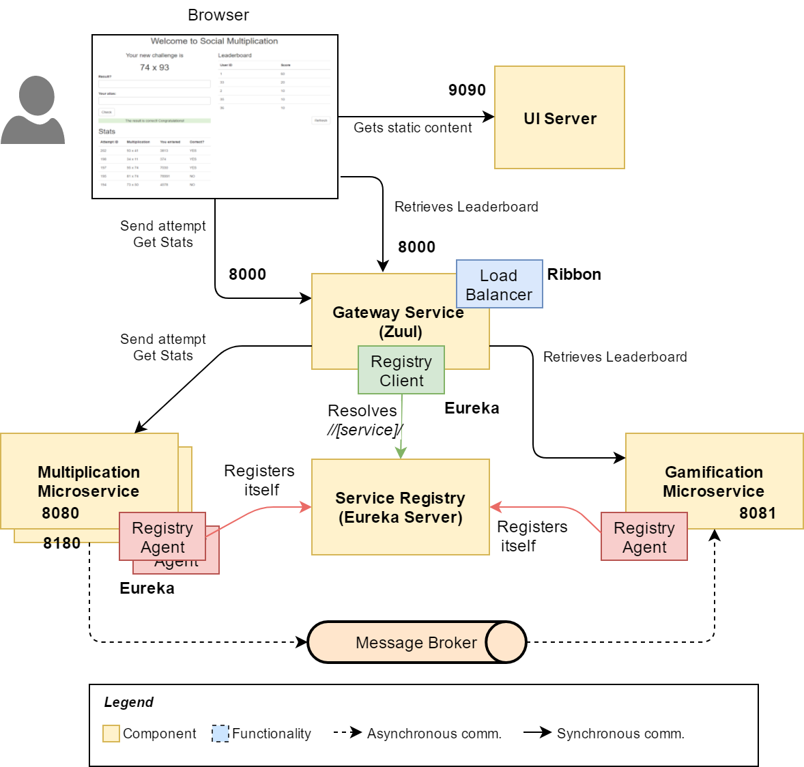

# Microservices - The Practical Way - v8

This project contains the version 8 of the application that is developed under the scope of the book Microservices - The Practical Way. 
You can get a copy of the book on [Leanpub](https://leanpub.com/microservices-thepracticalway).

## Idea

These projects, included in [Microservices-Practical repositories](https://github.com/microservices-practical), illustrate how to start an application from scratch and then evolve it to become a full microservices environment.

This version introduces Load Balancing with Ribbon, configured to detect services that are down through a `PingUrl` and combined with an `AvailabilityFilteringRule`.

## Contents

The repository contains five folders, one for each component of the system:

* **social-multiplication** is one of the backend services. It has a REST API to get and provide results to simple multiplications. When an attempt is sent, it triggers an *event*.
* **gamification** is the second backend service. It provides a REST API to get game stats and reacts to the event sent by the multiplication service, updating the figures.
* **service-registry** is the Eureka Server, which is contacted by backend services and the gateway.
* **gateway** is the Routing Service, implemented with Zuul. It connects with Eureka for service discovery, and performs load balancing with Ribbon.
* **ui** contains the static files of the frontend application. It's configured to be started with Jetty.

## How to execute the application

Since in this version we don't have yet scripts to do it, we need to run the applications manually. These are the instructions:

* **UI**. Download and install [Jetty](http://www.eclipse.org/jetty/download.html). From the command line, execute `java -jar [JETTY_HOME]/jetty-[VERSION]/start.jar` (replace the values between brackets accordingly). You also need Java.
* **RabbitMQ**. Download and install [RabbitMQ](https://www.rabbitmq.com/download.html). We use it as Event bus. When you have installed it, you need to run the RabbitMQ server (as a service or as a process, whatever you prefer).
* **Multiplication, Gamification, Service Registry and Gateway**. You need to start all these services using the command line. Navigate to each folder and execute for every one of them: `./mvnw spring-boot:run`. If you want to try load balancing you can execute more than one instance of the Multiplication or Gamification service. To do that, override the port number to avoid clashing: `./mvnw spring-boot:run -Drun.arguments="--server.port=A_FREE_PORT]"`

## Do you want to know more?

If you want more details about the different application parts and how to get there from scratch, you can buy the book if you don't have it yet: [Microservices - The Practical Way](https://leanpub.com/microservices-thepracticalway)
